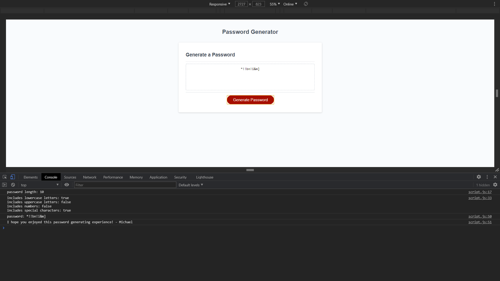

# Chartreuse Strong

Welcome to my random password generator!

When the 'Generate Password' button is clicked, the generator will first ask the user how long they would like their password to be. The generator will then ask the user which types of characters they would like to include in their password. A password will then be randomly generated and displayed on the page. 

If the user clicks the buttonand generates a new password, the previous password will be overwritten.

Here is a [link to the deployed site.](https://mikeyrod22.github.io/chartreuse-strong/)

Here are a few screenshots demonstrating the functionality:

*WARNING* This was a small project for my class. *The passwords generated here are not intended for secure use.* Please do not use this for generating important passwords. This was merely a Javascript exercise.

This project started by cloning the starter code located in the ['friendly-parakeet' github repository.](https://github.com/coding-boot-camp/friendly-parakeet)

